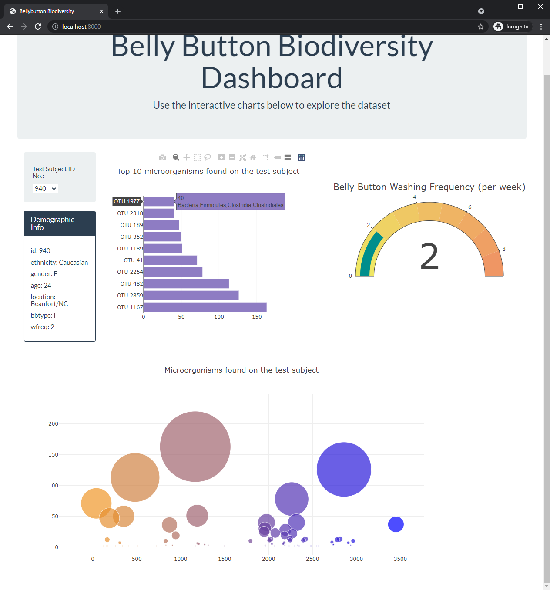
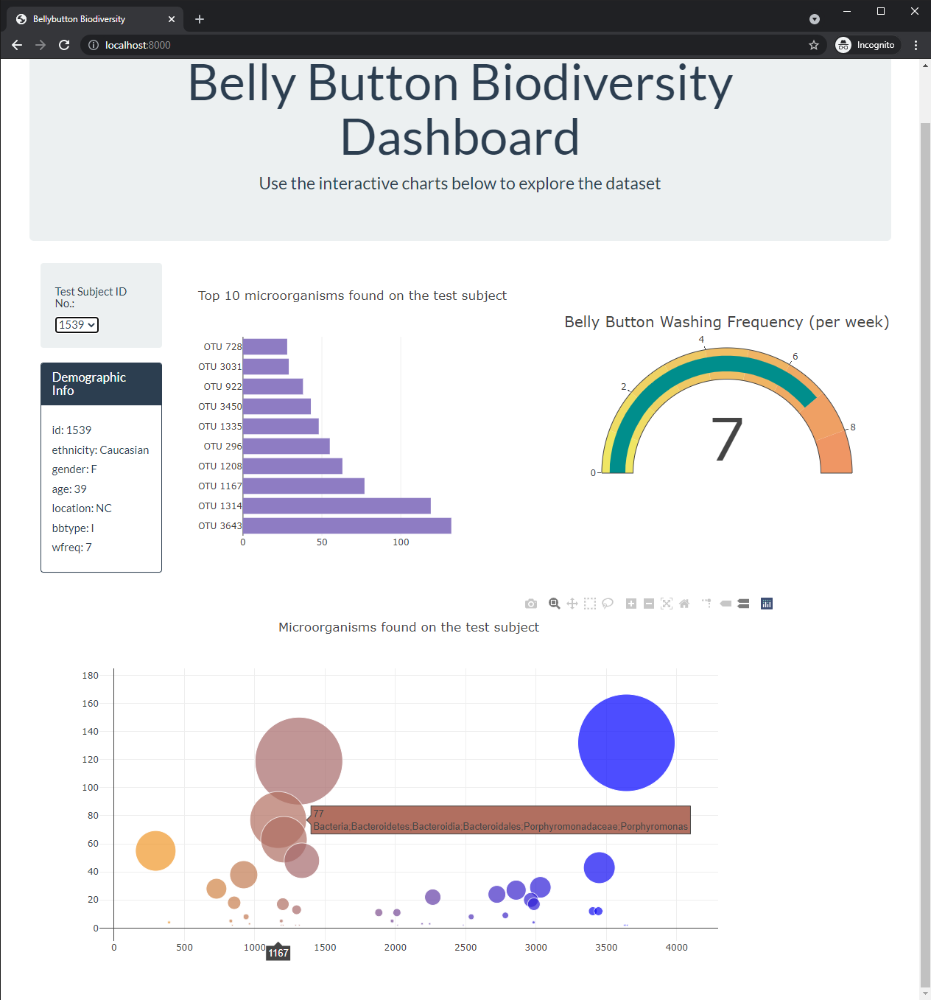

# Belly Button Biodiversity

In this assignment (Data Analysis Bootcamp), I have built an interactive dashboard using JavaScript (Plotly and D3) to explore the [Belly Button Biodiversity dataset](http://robdunnlab.com/projects/belly-button-biodiversity/), which catalogs the microbes that colonize human navels.

### About the Data

Hulcr, J. et al.(2012) _A Jungle in There: Bacteria in Belly Buttons are Highly Diverse, but Predictable_. Retrieved from: [http://robdunnlab.com/projects/belly-button-biodiversity/results-and-data/](http://robdunnlab.com/projects/belly-button-biodiversity/results-and-data/)

### Is it a complete project?
 Yes and no. I am working on visual aspect - colors, fonts etc.
